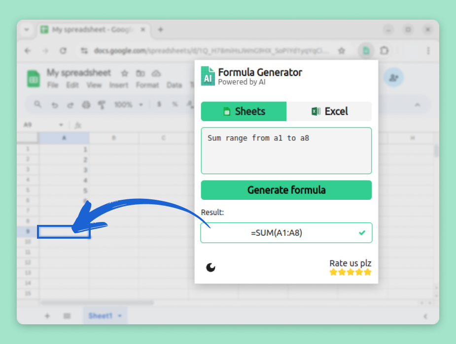

### [🌟 Excel Formula Generator Chrome Extension](https://chromewebstore.google.com/detail/excel-formula-generator/cdibfdjnmkcaagmlgfpfckbggbhiicmc)

# Excel Formula Generator
AI-powered Excel and Google Sheets Formula Generator to create functions based on text descriptions.

## Introduction
Free Excel Formula Generator is available in [Chrome Web Store](https://chromewebstore.google.com/detail/excel-formula-generator/cdibfdjnmkcaagmlgfpfckbggbhiicmc).

Excel Formula Generator is your assistant for quickly creating functions for Google Sheets and Excel from plain text descriptions.

## Features
- ✅ **Excel or Sheets**: Choose the tool you need.
- ✨ **Quick Formula Generation**: Enter a description and get the formula instantly.
- 📋 **One-Click Copy**: Copy the formula and paste it into your table.
- 🌙 **Day & Night Themes**: Work comfortably anytime.
- 📜 **Query History**: Access and reuse past queries easily.

## Getting Started
1. Install by clicking "Add to Chrome".
2. Choose Excel or Google Sheets.
3. Enter your function description.
4. Generate the formula.
5. Copy and paste it into your table.

## Who Is It For?
- **📊 Analysts and Office Workers**: Quickly create complex formulas.
- **👨‍🎓 Students and Teachers**: Generate functions for educational tasks.
- **💼 Professionals**: Increase productivity by automating function creation.

## Why Choose Excel Formula Generator?
- Generates formulas for both Excel and Google Sheets.
- Saves time on finding the right function.
- Simple, user-friendly interface.
- Free and ad-free.
- Respects your privacy.

### Save Time & Boost Efficiency
Generate formulas in seconds without learning syntax. Ideal for students, analysts, and accountants — easy to use for everyone.

### Learn by Doing
Understand complex formulas by watching how they are built. Improve your skills effortlessly.

## Key Benefits
- **Ease of Use**: Create functions in a few simple steps.
- **Time-Saving**: No need to write formulas manually.
- **Day & Night Themes**: Work comfortably at any time.
- **History Access**: Quickly revisit past formulas.
- **Supports Excel & Sheets**: Suitable for all spreadsheet users.

## FAQs
- **How to install?**
  Go to Chrome Web Store, click "Add to Chrome", then find it in your extensions panel.
- **How does it work?**
  Enter a description, and it generates functions for Excel or Google Sheets.
- **Is it free?**
  Yes, it is entirely free.
- **Privacy concerns?**
  We do not collect any personal data.
- **Usage limits?**
  No limits — generate as many formulas as you need!

🚀 **Simplify your work with [Excel Formula Generator](https://chromewebstore.google.com/detail/excel-formula-generator/cdibfdjnmkcaagmlgfpfckbggbhiicmc) today!**

